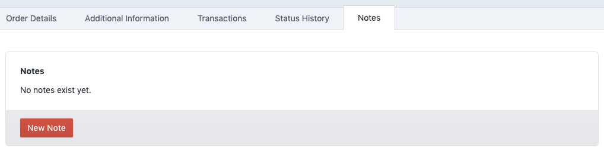
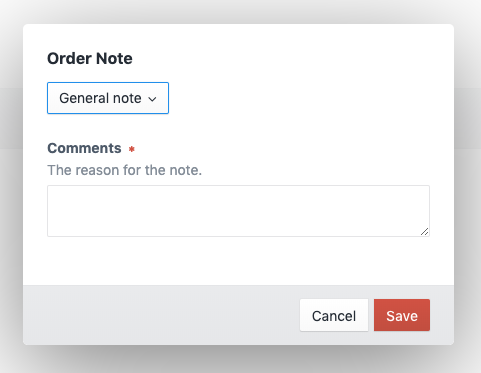
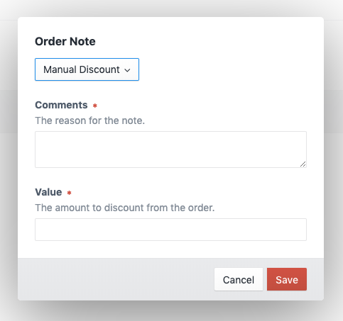
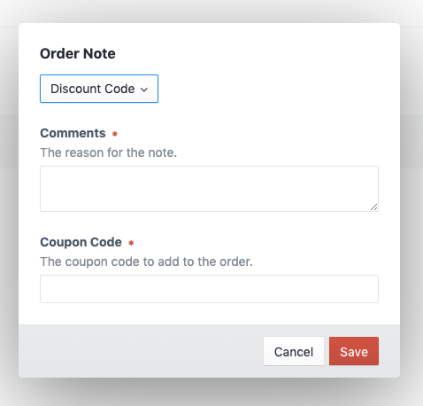
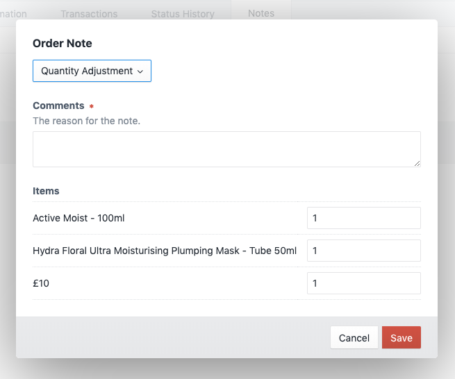
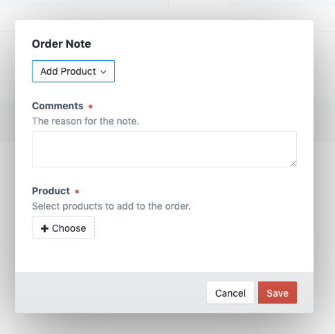
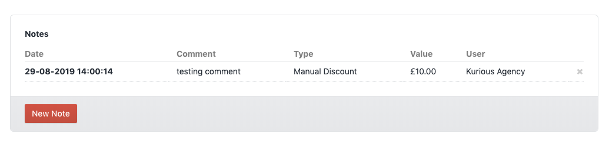
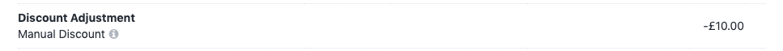
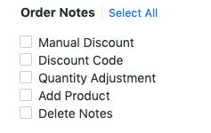

# Commerce Order Notes plugin for Craft CMS 4.x

Add notes to an order, they can also affect price.

## Requirements

This plugin requires Craft CMS 4 and Craft Commerce 4.

## Installation

You can install this plugin from the Plugin Store or with Composer.

#### From the Plugin Store

Go to the Plugin Store in your project’s Control Panel and search for Commerce Order Notes”. Then click on the “Install” button in its modal window.

#### With Composer

Open your terminal and run the following commands:

```bash
# go to the project directory
cd /path/to/my-project

# tell Composer to load the plugin
composer require webdna/commerce-order-notes

# tell Craft to install the plugin
./craft install/plugin commerce-order-notes
```

## Features

This plugin will add a notes tab to the order detail page.



All note types are available when an order/cart has not been fully paid, but the following are only available when and order is fully paid:

-   General
-   Quantity Adjustment
-   Add Products

### Note Types

#### General Note


Leave comments about the order.

#### Manual Discount


You can enter a value that will be removed from the order.

#### Discount Code



#### Quantity Adjustment



#### Add Products



### Added notes


Once a note has been added you will be able to see an audit trail of the date and time as well as the user you created the note.

Please note that only admins can delete a note.

### Refunds

Any refunds issued will automatically create a note as well, so you will be able to see a full audit trail in one view.

### Price adjustments

Any note that changes the price will create an adjustment on the order.



### User Permissions

User permissions for each note type can be set.




Brought to you by [webdna](https://webdna.co.uk)
